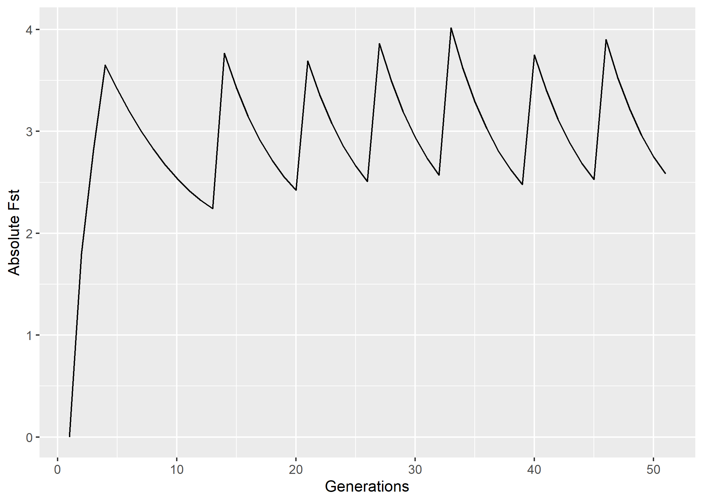
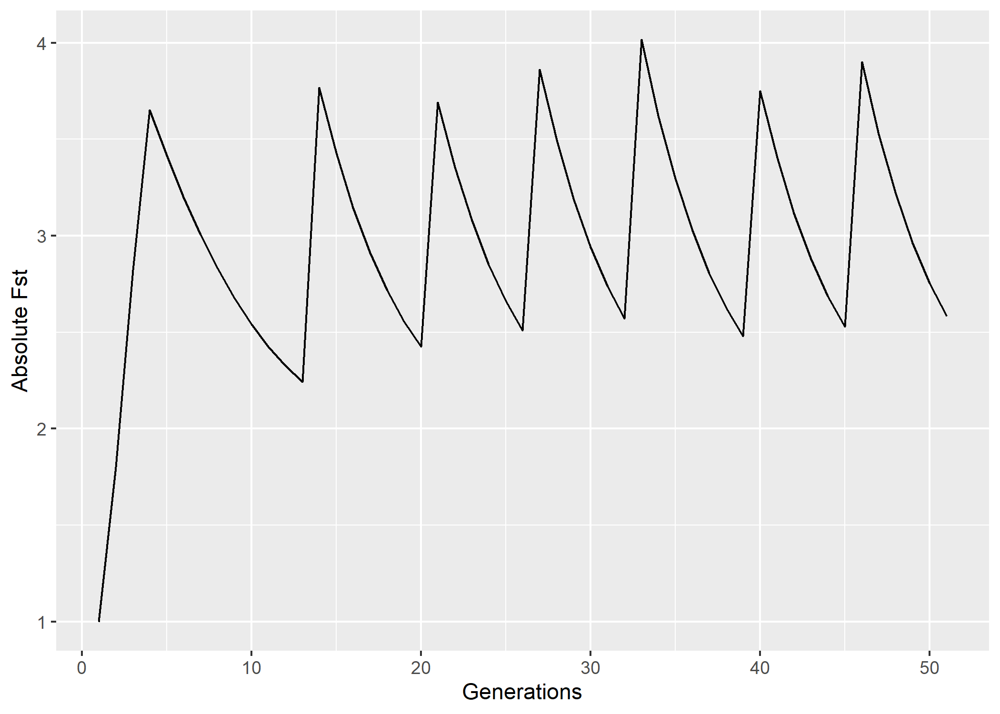
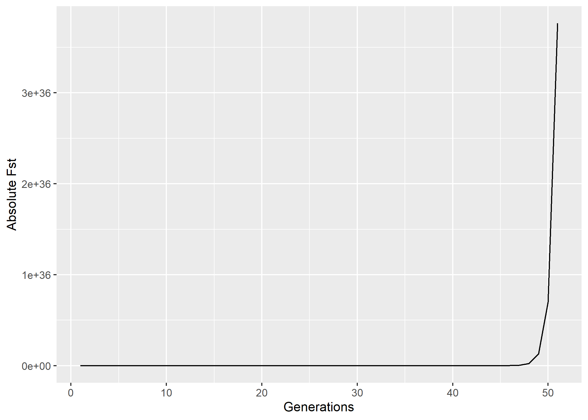

Marco Cacciabue, Roman Gonzalez Mora, Pablo Aguilera

<!-- README.md is generated from README.Rmd. Please edit that file -->

# **prisoneR** 

<!-- badges: start -->

[](https://github.com/marcocacciabue/prisoneR/actions)
<!-- badges: end -->

This a collection of functions that allows the user to simulate viral
dynamics interactions by using the prisoner dillema framework-

## Installation

You can install the development version from
[GitHub](https://github.com/) with:

``` r
# install.packages("devtools")
devtools::install_github("marcocacciabue/prisoneR")
```

## Example

This is a basic example which shows you how to run a simple simulation

``` r
library(prisoneR)

## First we create a simple list of parameters to run the simulation

params <- prepare_parameters()

# we can control or modify the relevant arguments accordingly

head(params)
#> $mutation1
#> [1] 1e-06
#> 
#> $mutation2
#> [1] 1e-06
#> 
#> $genome1
#> [1] 5000
#> 
#> $genome2
#> [1] 8500
#> 
#> $r1_1_1
#> [1] 0.9
#> 
#> $r2_1_1
#> [1] 0.19
```

Now that we have the parameters, we can run the simulation

``` r
library(prisoneR)
simulationLV <- game(
  type = "Lotka",
  play1 = "Count_defective", # strategy of player
  play2 = "Count_defective", # strategy of player 2,#
  parameters = params # list of parameters to pass to the game function
)
#> Running  Lotka  simulation for  50  generations with the following parameters 
#>  population 1 initial condition  0.1 
#>  population 2 initial condition  0.1
```

`SimulationLV` is a `data.frame()` with the simulation results.

``` r
head(simulationLV)
#>         xn1       xn2 Relative_fst Absolute_fst  Total_fst
#> 1 0.1000000 0.1000000     0.000000     1.000000 1.00000000
#> 2 0.2143934 0.1191230     1.799765     1.799765 0.55562800
#> 3 0.4011392 0.1421519     2.821905     2.821905 0.19689821
#> 4 0.6214614 0.1701634     3.652146     3.652146 0.05391302
#> 5 0.6734945 0.1971312     3.416478     3.416478 0.01578029
#> 6 0.7272209 0.2272049     3.200728     3.200728 0.00493022
```

*prisoneR* includes simple helper functions to plot the results. For
example, for plotting the relative Fst, simply use:

``` r
plot_relative(simulationLV)
```

 or for the
Absolute Fst run:

``` r
plot_absolute(simulationLV)
```

 We can also
run the simulation under May logistic map

``` r
library(prisoneR)
simulationMAY <- game(
  type = "May",
  play1 = "Count_defective", # strategy of player
  play2 = "Count_defective", # strategy of player 2,#
  parameters = params # list of parameters to pass to ode solver
)
#> Running  May  simulation for  50  generations with the following parameters 
#>  population 1 initial condition  0.1 
#>  population 2 initial condition  0.1
```

And then plot the results

``` r
plot_absolute(simulationMAY)
```


